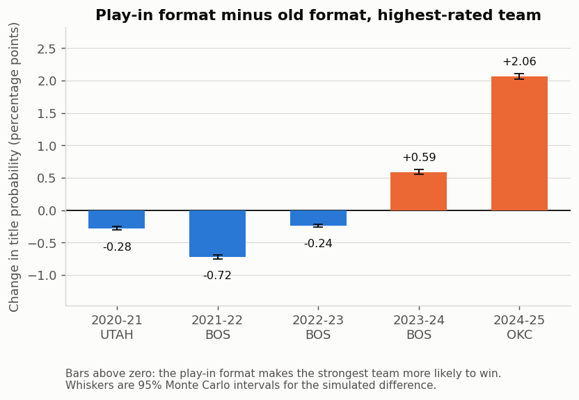
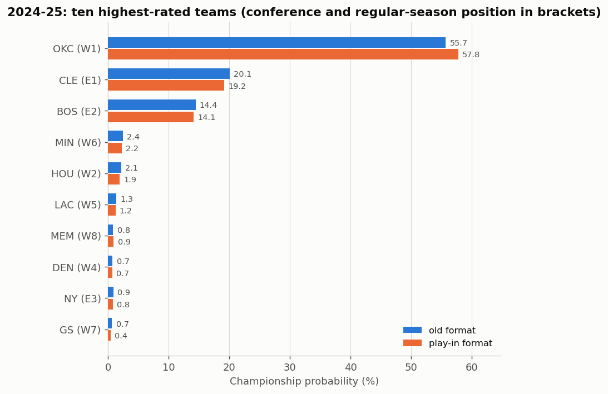
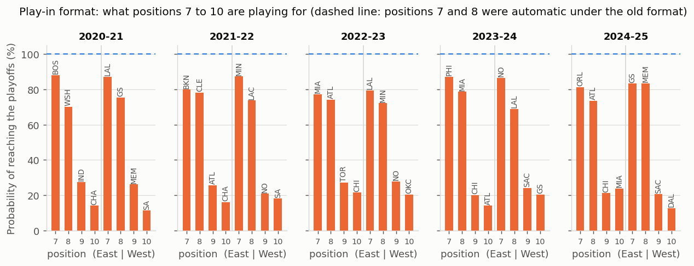
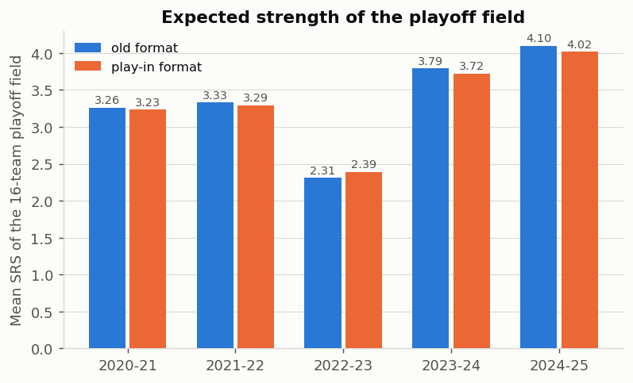
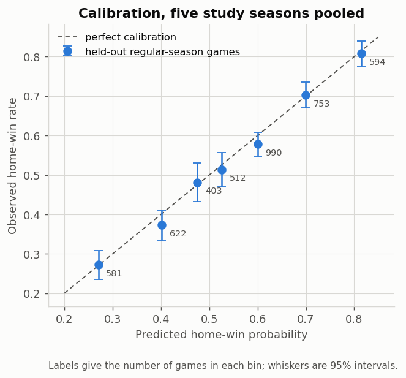
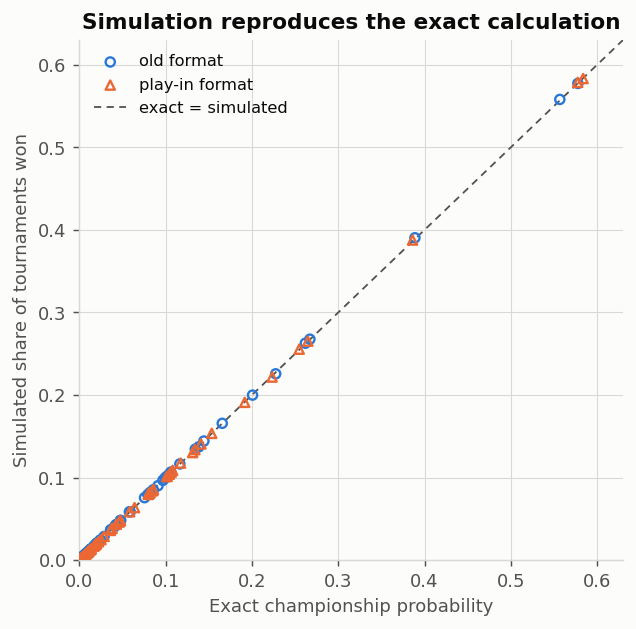
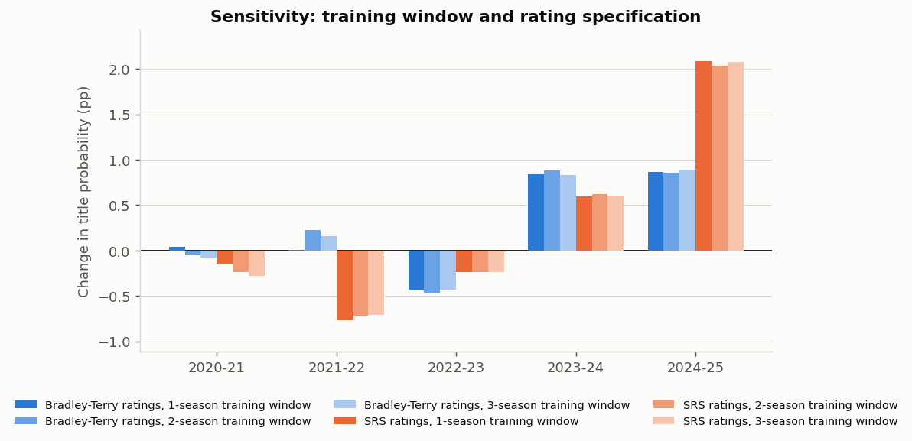

# NBA Play-In Study

**Does the play-in tournament actually help the best team win the title? A model-based counterfactual over the five seasons it has existed.**

[](https://www.python.org/)
[](https://numpy.org/)
[](https://pandas.pydata.org/)
[](https://scipy.org/)
[](https://matplotlib.org/)
[](tests/)
[](LICENSE)

Take a season's final standings and team ratings, freeze them, and run the playoffs
two ways: the **old format**, where the top eight teams in each conference qualify
outright, and the **play-in format**, where positions 7 to 10 fight for the last two
seeds. Everything else is held identical. The difference in the strongest team's
championship probability is the answer.

Five seasons: 2020-21 through 2024-25. 9,519 regular-season games. 500,000 simulated
tournaments per format per season, checked against an exact calculation.

---

## Visual Demo

**The headline result.** Bars above zero mean the play-in made the strongest team
*more* likely to win the title. Whiskers are 95% Monte Carlo intervals.



The average effect is **+0.29 percentage points** — positive in two seasons, negative
in three. The sign is not a property of the format. It depends on whether the play-in
happens to push a stronger or a weaker team into the seed the best team has to beat.

**2024-25, the one big season.** OKC finished first in the West, so it faced the
eighth seed. Under the old format that was Memphis, the strongest of the four play-in
teams; under the play-in format the eighth seed is Memphis only 35% of the time. OKC's
draw got easier.



**What positions 7 to 10 are actually playing for.** The dashed line is where
positions 7 and 8 used to sit: a guaranteed playoff spot.



---

## Features

- **Two complete tournament implementations** — old qualification format and the real
  play-in, with the correct fixed bracket (1-8, 4-5, 2-7, 3-6), no reseeding, and
  2-2-1-1-1 home-court sequences.
- **Exact probabilities, not just simulation** — best-of-seven series solved by
  backward recursion, so venue-dependent game probabilities are handled exactly. All
  six ordered (seed 7, seed 8) play-in outcomes enumerated per conference, and all 36
  combinations crossed.
- **The play-in joint distribution is kept intact** — seed 7 and seed 8 are dependent,
  and a test fails if anyone replaces the joint with a product of marginals.
- **500,000 Monte Carlo tournaments per format per season**, simulating individual
  games rather than drawing champions from the answer, with common random numbers so
  the paired standard error is ~5x smaller than an independent design.
- **A real data audit** — 18 checks against three independent sources. It resolved the
  workbook's 12 disputed scoring totals and found a new defect: one archive game dated
  a day late.
- **Held-out validation** — Brier score, log loss and calibration against a
  home-win-rate baseline, with regular season, play-in and playoffs scored separately.
- **Six sensitivity analyses** — training window, an alternative rating specification,
  four Finals home-court rules, and both open data issues.
- **Reproducible in one command**, about 20 seconds, with a fixed documented seed.

---

## Tech Stack

| Layer | What is used |
| --- | --- |
| Language | Python 3.9+ |
| Numerics | NumPy (vectorised simulation), SciPy (`L-BFGS-B` maximum likelihood, `expit`) |
| Data | pandas, openpyxl (Excel), lxml (HTML tables) |
| Charts | Matplotlib, exported as PNG and SVG |
| Report | Markdown → HTML (`markdown`) → PDF (headless Chrome) |
| Tests | pytest, 43 tests |
| Sources | ESPN standings and box-score APIs, the sportsdataverse/hoopR schedule archive, Basketball-Reference |

No database, no web server, no framework. Plain Python and a virtual environment.

---

## Getting Started

```bash
git clone git@github.com:atickoo741-art/nba-playin-study.git
cd nba-playin-study

./setup.sh                          # creates .venv and installs dependencies
.venv/bin/python run_all.py         # the whole study, about 20 seconds
```

That writes every table to `outputs/tables/`, every chart to `outputs/figures/`, the
report to `reports/`, and a timestamped log to `logs/`.

Manual setup, if you prefer:

```bash
python3 -m venv .venv
.venv/bin/pip install -r requirements.txt
.venv/bin/python run_all.py
```

The first run downloads the source data from GitHub, ESPN and Basketball-Reference and
caches it under `data/external/`, so every run after that works offline.

---

## Usage Examples

**Run it faster while iterating**

```bash
.venv/bin/python run_all.py --replicates 50000   # noisier, ~5 seconds
.venv/bin/python run_all.py --skip-audit         # skip the network-backed checks
.venv/bin/python run_all.py --no-report          # tables and charts only
.venv/bin/python run_all.py --seed 12345         # a different random stream
```

**Run the tests**

```bash
.venv/bin/python -m pytest tests -q              # 43 passed
.venv/bin/python -m pytest tests/test_series.py -v
```

**Solve one season yourself**

```python
import sys; sys.path.insert(0, "src")
from nbaplayin import build, model, tournament

study = build.load_study()
fit   = model.fit_window(study.features, 2025, window=3)   # 3 prior seasons
model_2025 = build.season_model(study, 2025, fit)
result = tournament.solve_season(model_2025)

okc = model_2025.codes.index("OKC")
print(f"beta={fit.beta:.4f}  h={fit.h:.4f}")
print(f"old format     {result.title_old[okc]:.4f}")
print(f"play-in format {result.title_new[okc]:.4f}")
print(f"difference     {(result.title_new[okc] - result.title_old[okc]) * 100:+.2f} pp")
```

```
beta=0.1129  h=0.2225
old format     0.5568
play-in format 0.5776
difference     +2.08 pp
```

**Probability of winning a best-of-seven with home court**

```python
from nbaplayin.tournament import series_probability

# Game-by-game win probabilities in the 2-2-1-1-1 sequence H,H,A,A,H,A,H
ps = [0.62, 0.62, 0.47, 0.47, 0.62, 0.47, 0.62]
print(f"{series_probability(ps):.4f}")     # 0.6218
```

**Simulate one season and compare with the exact answer**

```python
from nbaplayin import montecarlo

mc = montecarlo.simulate_season(model_2025, replicates=200_000, seed=20250921)
print(f"simulated {mc.wins_new / mc.replicates:.4f} vs exact {result.title_new[okc]:.4f}")
print(f"difference {mc.paired_mean * 100:+.3f} pp  (se {mc.paired_se * 100:.3f} pp)")
```

---

## Results

| Season | Highest-rated team | Old format | Play-in format | Difference |
| --- | --- | --- | --- | --- |
| 2020-21 | UTAH | 39.05% | 38.77% | −0.28 pp |
| 2021-22 | BOS | 26.27% | 25.55% | −0.72 pp |
| 2022-23 | BOS | 26.76% | 26.52% | −0.24 pp |
| 2023-24 | BOS | 57.74% | 58.33% | +0.59 pp |
| 2024-25 | OKC | 55.80% | 57.87% | **+2.06 pp** |

**Five-season average, equal weight: +0.29 percentage points.**

The expected strength of the sixteen-team playoff field falls slightly under the
play-in format in four seasons of five, and rises in 2022-23, when the teams sitting
in positions 9 and 10 were genuinely better than the ones in 7 and 8.



Full write-up, with every equation, audit finding and caveat:
**[`reports/report.md`](reports/report.md)** — also as `report.html` and a 29-page
`report.pdf`.

---

## How It Works

```
NBA_PlayIn_Whiteboard_Data.xlsx
        │
        │  audit.py ........... checked against the hoopR archive, the ESPN
        │                       standings and box-score APIs, and
        │                       Basketball-Reference
        ▼
   9,519 regular-season games, 150 team-seasons
        │
        │  ratings.py ......... full-season SRS frozen before the postseason,
        │                       plus pregame SRS rebuilt date by date
        ▼
   7,048 training rows with no future information
        │
        │  model.py ........... P(A beats B) = sigmoid(β·(Rᴀ − Rʙ) + h·H)
        │                       fitted on the three prior seasons
        ▼
   β ≈ 0.113 per SRS point, h ≈ 0.24 (home court ≈ 2 points of rating)
        │
        ├──► tournament.py .... both formats, solved exactly
        ├──► montecarlo.py .... 500,000 tournaments per format per season
        ├──► validation.py .... held-out Brier, log loss, calibration
        └──► sensitivity.py ... window, ratings, hosting rule, data issues
```

**SRS** rates a team by its average scoring margin plus the average rating of its
opponents, so all 30 ratings are solved together as one linear system anchored by
making them sum to zero.

**The game model** turns a rating gap into a win probability: multiply by `β` to get
log-odds, add `h` if at home, subtract it if away, then squash with the logistic
function. Fitted by maximum likelihood on earlier seasons only.

---

## Validation

The model is fitted on the three seasons *before* the one it is tested on, so no test
outcome ever touches its own fit.

| Test set | Games | Brier (model) | Brier (baseline) | Log loss (model) | Log loss (baseline) |
| --- | --- | --- | --- | --- | --- |
| Regular season | 4,455 | **0.2189** | 0.2482 | **0.6268** | 0.6896 |
| Play-in games | 30 | **0.2218** | 0.2323 | **0.6352** | 0.6576 |
| Playoffs | 422 | **0.2304** | 0.2441 | **0.6530** | 0.6813 |

The baseline is the historical home-win rate, fitted on the same training window — a
fair comparison, not a straw man. The model beats it on every set.

Calibration matters more than accuracy here, because these probabilities get
multiplied together through four rounds:



And the simulator agrees with the exact calculation across all 300 team-format-season
comparisons — largest gap 0.0019, which is what 300 comparisons should produce:



---

## Sensitivity



| Assumption changed | Effect on the result |
| --- | --- |
| Training window (1, 2 or 3 seasons) | stays inside [−0.77, +2.09] pp; signs stable |
| Rating specification (Bradley-Terry instead of SRS) | **names a different strongest team in two seasons and flips the sign in 2022-23** |
| Finals home-court rule (four variants tried) | identical to machine precision |
| Disputed scoring totals | at most 0.020 pp |
| Mis-dated archive game corrected | at most 0.00004 pp |

The rating specification is the one that matters. "Strongest" is itself an estimate.

---

## Data Audit

Eighteen checks against three independent sources. Two findings worth naming:

- **The 12 disputed scoring totals are resolved.** Pairing each points-for gap with the
  matching points-against gap narrows them to 21 candidate games. All 21 ESPN box
  scores agree with the game table, and Basketball-Reference matches the game log on
  all 12 team-seasons. The ESPN *standings aggregate* is the outlier, so no score was
  corrected.
- **A new defect was found.** Game `401161536` (GS 115, PHX 99) is dated 2020-03-01 in
  the archive, which puts two Golden State games on the same day; it was played
  2020-02-29. Score right, date off by one, effect negligible.

Every check and its result: [`outputs/tables/audit_findings.csv`](outputs/tables/audit_findings.csv).

---

## Repository Layout

| Path | What is in it |
| --- | --- |
| `run_all.py` | single-command reproduction |
| `setup.sh` | creates the virtual environment |
| `src/nbaplayin/` | all analysis code, one module per step |
| `tests/` | 43 tests |
| `data/raw/` | the original workbook, unchanged |
| `data/processed/` | computed team ratings and season tallies |
| `outputs/tables/` | every result table as CSV, plus `results.json` |
| `outputs/figures/` | seven charts, PNG and SVG |
| `reports/` | the report in Markdown, HTML and PDF |
| `logs/` | one log per run (git-ignored) |

`data/external/` is git-ignored: `run_all.py` re-downloads and caches it. So
are `logs/` and the two large derived game tables in `data/processed/`, which
are rebuilt from the workbook on every run rather than redistributed here.

---

## What This Study Does Not Claim

It is a counterfactual inside a model, not the causal effect of the policy.

1. **Standings and ratings are frozen.** A real play-in changes what teams do in
   March — who rests, who tanks, who fights for seventh instead of settling for ninth.
   None of that is modelled.
2. **"Strongest" is an estimate.** A rating fitted to wins and losses alone names a
   different strongest team in two of the five seasons, and reverses the sign in one.
3. **Five seasons is five observations.** The Monte Carlo intervals describe simulation
   noise only — not uncertainty about the ratings, the model, or the true effect.

---

## Contributing

Issues and pull requests are welcome.

- **Open an issue before starting a pull request**, so the approach can be agreed first.
- **Run the tests before pushing:** `.venv/bin/python -m pytest tests -q`. Anything
  that changes the numbers should come with a test that would have caught the old
  behaviour.
- **Do not change a modelling choice to improve the tournament conclusion.** New model
  variants belong in `sensitivity.py`, reported next to the baseline whatever they show.
- **Keep the report generated, never hand-edited.** Every number in `reports/report.md`
  is read out of the result tables by `report.py`; edit the code, then re-run
  `run_all.py`.
- Match the surrounding style: descriptive names, docstrings that say *why*, and one
  commit per unit of work.

---

## Licence & Credits

Code released under the [MIT Licence](LICENSE). The NBA game data is not mine: it
belongs to its sources and is used here for non-commercial research.

**Author** — Aditya Tickoo ([@atickoo741-art](https://github.com/atickoo741-art))

**Data sources**

- [sportsdataverse / hoopR-nba-data](https://github.com/sportsdataverse/hoopR-nba-data) — the ESPN schedule archive the game table is built from
- [ESPN](https://www.espn.com/nba/) — standings and box-score APIs
- [Basketball-Reference](https://www.basketball-reference.com/) — independent third source for the disputed scoring totals
- [NBA.com](https://www.nba.com/news/nba-play-in-tournament) — official play-in rules
- [NBA G League tiebreaker rules](https://gleague.nba.com/2018-19-tiebreakers/) — the opposite-conference chain used for Finals home court

**Tooling** — built with [Claude Code](https://claude.com/claude-code).
